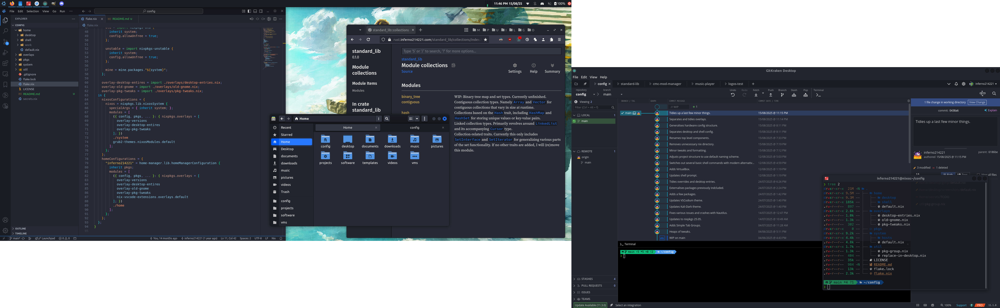

# My NixOS Config

This repo contains my current NixOS config (XFCE + Kali Dark).

Storing this on GitHub is more convenient for me but on the off chance that you find something
helpful here, feel free to use it!

# Structure

- `home`: Files related to managing my home directory, user and general software.
  - `desktop`: Configuration for desktop sessions, including DE and GUI-based software.
  - `shell`: Configuration for shell sessions, including CLI programs.
- `overlays`: Various overlays that I apply to nixpkgs for use on my system.
- `pkgs`: Packages that I write for other people's existing software that I'm installing. (Note:
Software that I've written (or forked) isn't included here, but instead in my [pkgs
repo](https://github.com/inferno214221/my-pkgs).)
- `system`: Configuration files for my NixOS system.
  - `hosts`: Hardware specific configs for my devices (Only one at the moment).
- `util`: A couple of utility functions that I've written for personal usage.